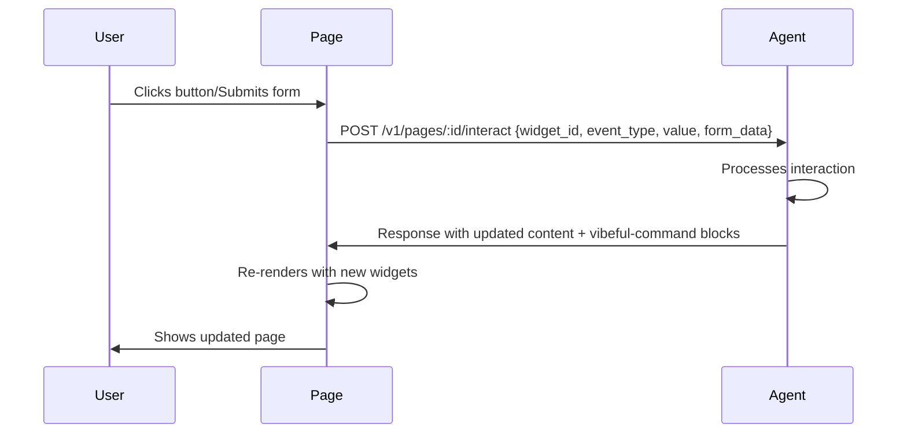

# Vibeful SDK Integration Guide

Embed AI agents into any application. Three integration tiers — from a script tag to fully agent-driven systems.

---

## Tier 1: Embed (Script Tag)

Add an agent chat widget to any HTML page with 3 lines.

```html
<!-- 1. Container -->
<div id="vibeful-chat" style="max-width:400px;height:500px"></div>

<!-- 2. SDK -->
<script src="https://cdn.vibeful.ai/sdk/vibeful-sdk.umd.js"></script>

<!-- 3. Mount -->
<script>
VibefulSDK.mount({
  target: '#vibeful-chat',
  agentId: 'YOUR_AGENT_ID',
  theme: {
    '--vibeful-user-bg': '#7c3aed',
    '--vibeful-send-bg': '#7c3aed'
  }
});
</script>
```

### React Component

```bash
npm install @vibeful/sdk
```

```tsx
import { VibefulChat, useVibefulAgent } from '@vibeful/sdk';

function MySupportPage() {
  const { messages, streaming, loading, citations, followUps, send } =
    useVibefulAgent({ agentId: 'YOUR_AGENT_ID' });

  return (
    <VibefulChat
      agentId="YOUR_AGENT_ID"
      messages={messages}
      streaming={streaming}
      loading={loading}
      citations={citations}
      followUps={followUps}
      onSend={send}
    />
  );
}
```

### Styling

Customize colors, fonts, and spacing with CSS custom properties:

| Variable | Default | Description |
|----------|---------|-------------|
| `--vibeful-bg` | `#0f172a` | Background |
| `--vibeful-fg` | `#e2e8f0` | Text |
| `--vibeful-user-bg` | `#6366f1` | User message bubble |
| `--vibeful-bot-bg` | `#1e293b` | Agent message bubble |
| `--vibeful-font` | `system-ui` | Font family |
| `--vibeful-radius` | `0.5rem` | Border radius |

---

## Tier 2: Integrate (Headless API)

Programmatic agent invocation from any backend. Use this when you need agents to drive business logic, not just chat widgets.

### JavaScript / TypeScript

#### Non-streaming (request/response)

```ts
import { useAgent } from '@vibeful/sdk';

const { invoke, result, loading, error } = useAgent({ agentId: 'agent-123' });

const handleUserQuestion = async (question: string) => {
  const res = await invoke(question, {
    systemPrompt: 'Be concise',
    temperature: 0.3,
    contextIds: ['ctx-kb-1'],
    mcpServerUrls: ['http://mcp-calc:3102'],
  });
  console.log(res.response);       // Agent's text response
  console.log(res.tool_calls);      // Tools called
  console.log(res.usage);           // Token usage
};
```

#### Streaming (real-time tokens)

```ts
import { useAgentStream } from '@vibeful/sdk';

const { text, toolCalls, streaming, done, stream } = useAgentStream({
  agentId: 'agent-123',
  onEvent: (event) => {
    if (event.type === 'tool_call') {
      console.log('Agent called tool:', event.tool?.name);
    }
  },
});

// Streaming UI
<button onClick={() => stream('Write a haiku about TypeScript')}>Ask</button>
<pre>{streaming ? text + '▊' : text}</pre>
```

### Python

```bash
pip install vibeful
```

```python
from vibeful import VibefulClient

client = VibefulClient(base_url="http://localhost:50052")

# Non-streaming
async def ask_agent():
    result = await client.execute("agent-123", "What is 2+2?")
    print(result.response)         # "2 + 2 equals 4."
    print(result.tool_calls)       # [{"name": "calculator", ...}]
    print(result.usage)            # {"total_tokens": 15}

# Streaming
async def stream_agent():
    async for event in client.stream("agent-123", "Write a haiku"):
        if event.type == "token":
            print(event.text, end="", flush=True)
        elif event.type == "tool_call":
            print(f"\n[Tool: {event.tool['name']}]")
        elif event.type == "complete":
            print(f"\n[Tokens: {event.usage['total_tokens']}]")

# With API key authentication
client = VibefulClient(
    base_url="https://vibeful.example.com",
    api_key="vf_your_key_here"
)
```

#### Python SDK Result Types

```python
from vibeful import AgentResult, StreamEvent

# AgentResult dataclass
result: AgentResult
result.agent_id    # str
result.session_id  # str
result.response    # str — the agent's text
result.tool_calls  # list[dict] — tools called
result.usage       # dict — token counts
result.error       # str | None
result.finished    # bool

# StreamEvent dataclass
event: StreamEvent
event.type     # "token" | "tool_call" | "tool_result" | "complete" | "error"
event.text     # str | None — text chunk for "token" events
event.tool     # dict | None — tool data for "tool_call"/"tool_result"
event.usage    # dict | None — token counts for "complete"
event.message  # str | None — error message
```

### REST API (Any Language)

```bash
# Headless execute
curl -X POST http://localhost:50052/v1/agents/agent-123/execute \
  -H "Content-Type: application/json" \
  -H "Authorization: Bearer vf_your_key" \
  -d '{"message": "What is the weather in London?"}'

# SSE streaming
curl -N -X POST http://localhost:50052/v1/agents/agent-123/stream \
  -H "Content-Type: application/json" \
  -d '{"message": "Tell me a story"}'
```

### Webhooks

Subscribe to agent events to build reactive workflows.

```bash
curl -X POST http://localhost:50052/v1/webhooks \
  -H "Content-Type: application/json" \
  -d '{
    "url": "https://myapp.example.com/hooks/vibeful",
    "events": ["conversation.completed"]
  }'
```

Your endpoint receives:

```json
{
  "event": "conversation.completed",
  "agent_id": "agent-123",
  "payload": {
    "agent_id": "agent-123",
    "session_id": "sess-456",
    "response": "The weather in London is...",
    "tool_calls": [...],
    "usage": {"total_tokens": 42},
    "finished": true
  }
}
```

Webhooks are asynchronous (fire-and-forget) with a 10-second timeout and best-effort delivery.

---

## Tier 3: Agent-Native (Agents Render the Application)

Agents can create and publish structured pages with embedded interactive widgets. When users interact with widgets, the agent processes the event and updates the page — creating a fully agent-driven application without custom front-end code.

### Creating an Agent Page

```python
# Python SDK (or use the management console)
import httpx

async def create_page():
    async with httpx.AsyncClient() as client:
        resp = await client.post("http://localhost:50052/v1/pages", json={
            "agent_id": "agent-123",
            "slug": "contact",
            "title": "Contact Us",
            "content_markdown": """# Contact Us

Please fill out the form below and we'll get back to you.

```vibeful-command
{"action":"render_widget","details":{"widget_id":"contact-form","type":"form","props":{"title":"Contact Form","fields":[{"key":"name","label":"Name","type":"text","required":true},{"key":"email","label":"Email","type":"email","required":true},{"key":"message","label":"Message","type":"textarea","required":true}],"submit_label":"Send"}}}
```
""",
            "published": 1
        })
```

Visit `http://localhost:5174/#/p/contact` to see the page.

### Widget Types

| Type | Description | Key Props |
|------|-------------|-----------|
| `button` | Clickable action | `label`, `variant` (primary/danger/secondary), `disabled` |
| `card` | Content card | `title`, `content`, `image_url`, `action` |
| `chart` | Bar/column chart | `title`, `items: [{label, value}]` |
| `table` | Data table | `columns: [{key, label}]`, `rows: [{...}]` |
| `form` | Input form | `title`, `fields: [{key, label, type, required}]`, `submit_label` |
| `image` | Image display | `src`, `alt`, `width`, `height` |
| `embed` | HTML embed | `html`, `sandbox` |
| `text` | Text block | `content` |

### Widget Event Loop

When a user interacts with a widget (click, form submit, etc.), the PageViewer sends the event to the page's agent, which processes it and can respond with new widgets or updated content:



The agent receives the full page context plus the user's interaction, so it can make informed decisions about what to update.

### Page Lifecycle

1. **Create** — Agent (or user via console) creates a page with markdown + widget blocks
2. **Edit** — Agent updates content, widgets, or publishing status via API
3. **Publish** — Published pages are visible at `/#/p/:slug`
4. **Interact** — Users trigger widget events → agent responds → page updates
5. **Iterate** — Agents refine pages based on user interactions and analytics

---

## Agent-to-Agent Delegation

For complex workflows, agents can delegate to other agents:

```python
# Agent A delegates to Agent B for a specialized task
result = await client.execute("agent-a", "I need a weather report for London")
# Agent A's tool calls included a delegation to Agent B
for tool in result.tool_calls:
    if tool["name"] == "delegate_to_agent":
        # Agent B's response is in tool["result"]
        print(tool["result"])
```

---

## Testing Agents

Create automated test cases that verify agent behavior:

```python
# Create a test
await client.post("/v1/agent-tests", json={
    "agent_id": "agent-123",
    "name": "greeting",
    "input_message": "Hello",
    "expected_contains": "Hi",
    "expected_not_contains": "I don't know"
})

# Run all tests for an agent
result = await client.post("/v1/agent-tests/run-all?agent_id=agent-123")
print(f"{result['passed']}/{result['total']} passed")
```

### Import / Export

Share and version-control agent configurations:

```python
# Export
yaml_content = await client.get("/v1/agents/agent-123/export")
with open("agent.vibeful.yaml", "w") as f:
    f.write(yaml_content)

# Import
await client.post("/v1/agents/import", json={"yaml_content": yaml_content})
```

### Staging → Production

Promote a tested agent from staging to production:

```python
await client.post("/v1/agents/promote", json={
    "source_agent_id": "agent-staging",
    "target_agent_id": "agent-production"
})
```
